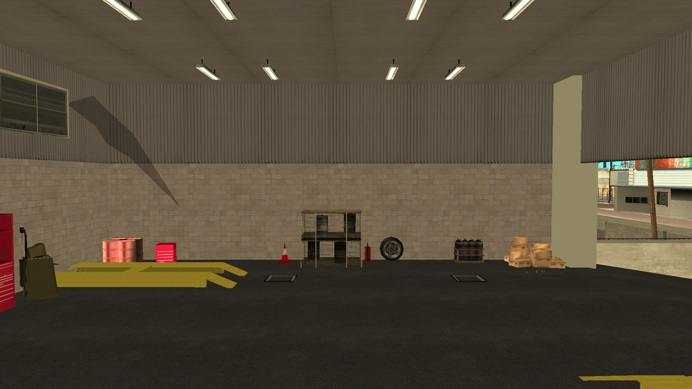

# maps-collection

Die maps-collection ist ein Repository, das kostenlos eine vielfältige Sammlung von Mappings für SA-MP (San Andreas Multiplayer) bereitstellt. Unser Ziel ist es, Entwicklern und Serverbetreibern Mappings zur Verfügung zu stellen und die Erstellung immersiver und individueller Serverumgebungen zu erleichtern.

## Sprachen

- Português: [README](../../)
- English: [README](../English/README.md)
- Español: [README](../Espanol/README.md)
- Français: [README](../Francais/README.md)
- Italiano: [README](../Italiano/README.md)
- Polski: [README](../Polski/README.md)
- Русский: [README](../Русский/README.md)
- Svenska: [README](../Svenska/README.md)
- Türkçe: [README](../Turkce/README.md)

## Inhaltsverzeichnis

- [maps-collection](#maps-collection)
  - [Sprachen](#sprachen)
  - [Inhaltsverzeichnis](#inhaltsverzeichnis)
  - [Merkmale](#merkmale)
  - [Mappings](#mappings)
    - [Autowerkstatt](#autowerkstatt)
  - [Lizenz](#lizenz)
    - [Nutzungsbedingungen](#nutzungsbedingungen)
      - [1. Gewährte Berechtigungen](#1-gewährte-berechtigungen)
      - [2. Verpflichtende Bedingungen](#2-verpflichtende-bedingungen)
      - [3. Urheberrecht](#3-urheberrecht)
      - [4. Gewährleistungsausschluss und Haftungsbeschränkung](#4-gewährleistungsausschluss-und-haftungsbeschränkung)

## Merkmale

Die bereitgestellten Mappings werden im Include-Format verteilt und bieten maximale Flexibilität für Entwickler. Benutzer können:

- Das Include einfach in ihrem Gamemode aktivieren und sofort das komplette Mapping integrieren.
- Den Quellcode kopieren und direkt in ihrem eigenen Gamemode anpassen, falls sie eine detailliertere Personalisierung wünschen.

Die Includes werden mit Intelligenz und Kompatibilität entwickelt:

- Enthalten bedingte Überprüfungen mit `#if !defined` und `#elseif defined` zur automatischen Erkennung des [streamer](https://github.com/samp-incognito/samp-streamer-plugin) Includes/Plugins.
- Wenn der [streamer](https://github.com/samp-incognito/samp-streamer-plugin) Plugin aktiv ist, werden Objekte mit `CreateDynamicObject()` erstellt.
- Wenn das [streamer](https://github.com/samp-incognito/samp-streamer-plugin) Include/Plugin nicht vorhanden ist, werden Objekte mit `CreateObject()` erstellt.

## Mappings

### Autowerkstatt

- Include: [01-workshop](../../maps-sources/01-workshop.inc)
- Screenshots:
  
  
  
  
  
  
  

## Lizenz

Copyright © **SA-MP Programming Community**

Diese Software ist unter den Bedingungen der MIT-Lizenz ("Lizenz") lizenziert; Sie dürfen diese Software gemäß den Lizenzbedingungen nutzen. Eine Kopie der Lizenz finden Sie unter: [MIT License](https://opensource.org/licenses/MIT)

### Nutzungsbedingungen

#### 1. Gewährte Berechtigungen

Diese Lizenz gewährt jeder Person, die eine Kopie dieser Software und der zugehörigen Dokumentationsdateien erhält, kostenlos folgende Rechte:
* Die Software ohne Einschränkungen zu nutzen, zu kopieren, zu modifizieren, zusammenzuführen, zu veröffentlichen, zu verteilen, zu unterlizenzieren und/oder zu verkaufen
* Personen, denen die Software zur Verfügung gestellt wird, dies unter den folgenden Bedingungen zu gestatten

#### 2. Verpflichtende Bedingungen

Alle Kopien oder wesentliche Teile der Software müssen enthalten:
* Den obigen Urheberrechtshinweis
* Diesen Erlaubnishinweis
* Den nachstehenden Haftungsausschluss

#### 3. Urheberrecht

Die Software und alle zugehörige Dokumentation sind durch Urheberrechtsgesetze geschützt. Die **SA-MP Programming Community** behält die ursprünglichen Urheberrechte an der Software.

#### 4. Gewährleistungsausschluss und Haftungsbeschränkung

DIE SOFTWARE WIRD "WIE BESEHEN" ZUR VERFÜGUNG GESTELLT, OHNE JEGLICHE AUSDRÜCKLICHE ODER IMPLIZITE GEWÄHRLEISTUNG, EINSCHLIESSLICH, ABER NICHT BESCHRÄNKT AUF DIE GEWÄHRLEISTUNG DER MARKTGÄNGIGKEIT, DER EIGNUNG FÜR EINEN BESTIMMTEN ZWECK UND DER NICHTVERLETZUNG VON RECHTEN DRITTER.

DIE AUTOREN ODER URHEBERRECHTSINHABER SIND IN KEINEM FALL HAFTBAR FÜR ANSPRÜCHE, SCHÄDEN ODER ANDERE VERPFLICHTUNGEN, OB IN EINER VERTRAGS- ODER DELIKTKLAGE, DIE AUS ODER IN VERBINDUNG MIT DER SOFTWARE ODER DER NUTZUNG ODER ANDEREN GESCHÄFTEN MIT DER SOFTWARE ENTSTEHEN.

---

For detailed information about the MIT License, visit: https://opensource.org/licenses/MIT