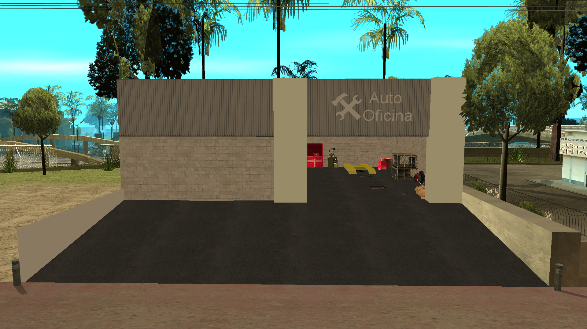

# maps-collection

Die maps-collection ist ein Repository, das kostenlos eine vielfältige Sammlung von Mappings für SA-MP (San Andreas Multiplayer) bereitstellt. Unser Ziel ist es, Entwicklern und Serverbetreibern Mappings zur Verfügung zu stellen und die Erstellung immersiver und individueller Serverumgebungen zu erleichtern.

## Sprachen

- Português: [README](../../)
- English: [README](../English/README.md)
- Español: [README](../Espanol/README.md)
- Français: [README](../Francais/README.md)
- Italiano: [README](../Italiano/README.md)
- Polski: [README](../Polski/README.md)
- Русский: [README](../Русский/README.md)
- Svenska: [README](../Svenska/README.md)
- Türkçe: [README](../Turkce/README.md)

## Inhaltsverzeichnis

- [maps-collection](#maps-collection)
  - [Sprachen](#sprachen)
  - [Inhaltsverzeichnis](#inhaltsverzeichnis)
  - [Merkmale](#merkmale)
  - [Mappings](#mappings)
    - [Autowerkstatt](#autowerkstatt)
  - [Lizenz](#lizenz)
    - [Was Sie tun können ✅](#was-sie-tun-können-)
    - [Was Sie tun müssen ⚠️](#was-sie-tun-müssen-️)
    - [Was Sie nicht tun können ❌](#was-sie-nicht-tun-können-)

## Merkmale

Die bereitgestellten Mappings werden im Include-Format verteilt und bieten maximale Flexibilität für Entwickler. Benutzer können:

- Das Include einfach in ihrem Gamemode aktivieren und sofort das komplette Mapping integrieren.
- Den Quellcode kopieren und direkt in ihrem eigenen Gamemode anpassen, falls sie eine detailliertere Personalisierung wünschen.

Die Includes werden mit Intelligenz und Kompatibilität entwickelt:

- Enthalten bedingte Überprüfungen mit `#if !defined` und `#elseif defined` zur automatischen Erkennung des [streamer](https://github.com/samp-incognito/samp-streamer-plugin) Includes/Plugins.
- Wenn der [streamer](https://github.com/samp-incognito/samp-streamer-plugin) Plugin aktiv ist, werden Objekte mit `CreateDynamicObject()` erstellt.
- Wenn das [streamer](https://github.com/samp-incognito/samp-streamer-plugin) Include/Plugin nicht vorhanden ist, werden Objekte mit `CreateObject()` erstellt.

## Mappings

### Autowerkstatt

- Include: [01-workshop](../../maps-sources/01-workshop.inc)
- Screenshots:
  
  
  
  
  
  
  

## Lizenz

Copyright © SA-MP Programming Community

Permission is hereby granted, free of charge, to any person obtaining a copy
of this software and associated documentation files (the "Software"), to deal
in the Software without restriction, including without limitation the rights
to use, copy, modify, merge, publish, distribute, sublicense, and/or sell
copies of the Software, and to permit persons to whom the Software is
furnished to do so, subject to the following conditions:

The above copyright notice and this permission notice shall be included in all
copies or substantial portions of the Software.

THE SOFTWARE IS PROVIDED "AS IS", WITHOUT WARRANTY OF ANY KIND, EXPRESS OR
IMPLIED, INCLUDING BUT NOT LIMITED TO THE WARRANTIES OF MERCHANTABILITY,
FITNESS FOR A PARTICULAR PURPOSE AND NONINFRINGEMENT. IN NO EVENT SHALL THE
AUTHORS OR COPYRIGHT HOLDERS BE LIABLE FOR ANY CLAIM, DAMAGES OR OTHER
LIABILITY, WHETHER IN AN ACTION OF CONTRACT, TORT OR OTHERWISE, ARISING FROM,
OUT OF OR IN CONNECTION WITH THE SOFTWARE OR THE USE OR OTHER DEALINGS IN THE
SOFTWARE.

Sie können eine Kopie der Lizenz hier erhalten:
https://opensource.org/licenses/MIT

### Was Sie tun können ✅

1. **Kommerzielle Nutzung**: 
   - Vollständige Freiheit zur kommerziellen Nutzung
   - Verkauf von Produkten basierend auf dem Code
   - Keine Lizenzgebühren erforderlich
   - Nutzung in proprietären Produkten

2. **Modifikation**: 
   - Vollständige Änderung des Quellcodes
   - Erstellung abgeleiteter Werke
   - Anpassung für jeden Zweck
   - Integration mit anderen Systemen

3. **Vertrieb**: 
   - Vertrieb der Originalsoftware
   - Weitergabe modifizierter Versionen
   - Einbindung in andere Projekte
   - Kommerzieller Vertrieb

4. **Private Nutzung**: 
   - Nutzung in privaten Projekten
   - Vertrauliche Änderungen
   - Keine Offenlegungspflicht
   - Uneingeschränkte interne Nutzung

5. **Unterlizenzierung**: 
   - Änderung der Lizenz für abgeleiteten Code
   - Wahl unterschiedlicher Bedingungen für Ihre Änderungen
   - Kombination mit anderen Lizenzen
   - Erstellung eigener Vertriebsbedingungen

### Was Sie tun müssen ⚠️

1. **Lizenz einbinden**: 
   - Lizenzkopie beim Code behalten
   - In allen Verteilungen einschließen
   - Originaltext bewahren
   - Sichtbar und zugänglich halten

2. **Attributierung**: 
   - Urheberrechtshinweis beibehalten
   - In allen Kopien einschließen
   - Ursprüngliche Credits bewahren
   - Codeursprung dokumentieren

### Was Sie nicht tun können ❌

1. **Autoren haftbar machen**: 
   - Keine Funktionsgarantien
   - Autoren haften nicht für Schäden
   - Keine verpflichtende Unterstützung
   - Nutzung auf eigenes Risiko