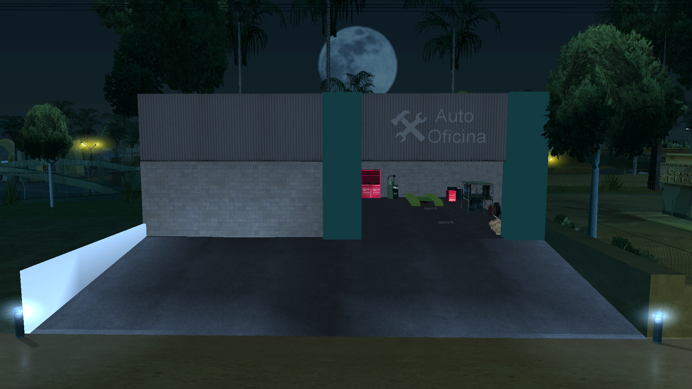

# maps-collection

The maps-collection is a repository dedicated to providing a diverse collection of mappings for SA-MP (San Andreas Multiplayer) free of charge. Our goal is to provide mapping for developers and server creators, facilitating the creation of immersive and customized environments in their servers.

## Languages

- Português: [README](../../)
- Deutsch: [README](../Deutsch/README.md)
- Español: [README](../Espanol/README.md)
- Français: [README](../Francais/README.md)
- Italiano: [README](../Italiano/README.md)
- Polski: [README](../Polski/README.md)
- Русский: [README](../Русский/README.md)
- Svenska: [README](../Svenska/README.md)
- Türkçe: [README](../Turkce/README.md)

## Index

- [maps-collection](#maps-collection)
  - [Languages](#languages)
  - [Index](#index)
  - [Features](#features)
  - [Mappings](#mappings)
    - [Auto Workshop](#auto-workshop)
  - [License](#license)
    - [What you can do ✅](#what-you-can-do-)
    - [What you must do ⚠️](#what-you-must-do-️)
    - [What you cannot do ❌](#what-you-cannot-do-)

## Features

The mappings provided are distributed in include format, offering maximum flexibility for developers. Users can:

- Simply activate the include in their Gamemode, instantly integrating the complete mapping.
- Copy the source code and adapt it directly in their own Gamemode, if they prefer more detailed customization.

The includes are developed with intelligence and compatibility in mind:

- They have conditional checks `#if !defined` and `#elseif defined` for automatic detection of the [streamer](https://github.com/samp-incognito/samp-streamer-plugin) include/plugin.
- If the [streamer](https://github.com/samp-incognito/samp-streamer-plugin) plugin is active, objects are created using `CreateDynamicObject()`.
- If the [streamer](https://github.com/samp-incognito/samp-streamer-plugin) include/plugin is not present, objects are created with `CreateObject()`.

## Mappings

### Auto Workshop

- Include: [01-workshop](../../maps-sources/01-workshop.inc)
- Screenshots:
  
  
  
  
  
  
  

## License

Copyright © SA-MP Programming Community

Permission is hereby granted, free of charge, to any person obtaining a copy
of this software and associated documentation files (the "Software"), to deal
in the Software without restriction, including without limitation the rights
to use, copy, modify, merge, publish, distribute, sublicense, and/or sell
copies of the Software, and to permit persons to whom the Software is
furnished to do so, subject to the following conditions:

The above copyright notice and this permission notice shall be included in all
copies or substantial portions of the Software.

THE SOFTWARE IS PROVIDED "AS IS", WITHOUT WARRANTY OF ANY KIND, EXPRESS OR
IMPLIED, INCLUDING BUT NOT LIMITED TO THE WARRANTIES OF MERCHANTABILITY,
FITNESS FOR A PARTICULAR PURPOSE AND NONINFRINGEMENT. IN NO EVENT SHALL THE
AUTHORS OR COPYRIGHT HOLDERS BE LIABLE FOR ANY CLAIM, DAMAGES OR OTHER
LIABILITY, WHETHER IN AN ACTION OF CONTRACT, TORT OR OTHERWISE, ARISING FROM,
OUT OF OR IN CONNECTION WITH THE SOFTWARE OR THE USE OR OTHER DEALINGS IN THE
SOFTWARE.

You can obtain a copy of the license at:
https://opensource.org/licenses/MIT

### What you can do ✅

1. **Commercial Use**: 
   - Complete freedom for commercial use
   - Can sell products based on the code
   - No royalty payments required
   - Can use in proprietary products

2. **Modification**: 
   - Complete modification of source code
   - Create derivative works
   - Adapt for any purpose
   - Integrate with other systems

3. **Distribution**: 
   - Distribute the original software
   - Share modified versions
   - Include in other projects
   - Distribute commercially

4. **Private Use**: 
   - Use in private projects
   - Confidential modifications
   - No disclosure obligation
   - Unrestricted internal use

5. **Sublicensing**: 
   - Can change the license of derivative code
   - Choose different terms for your modifications
   - Combine with other licenses
   - Create own terms for distribution

### What you must do ⚠️

1. **Include License**: 
   - Keep license copy with the code
   - Include in all distributions
   - Preserve original text
   - Keep visible and accessible

2. **Attribution**: 
   - Maintain copyright notice
   - Include in all copies
   - Preserve original credits
   - Document code origin

### What you cannot do ❌

1. **Hold Authors Liable**: 
   - No warranties of functionality
   - Authors are not responsible for damages
   - No mandatory support
   - Use at your own risk
