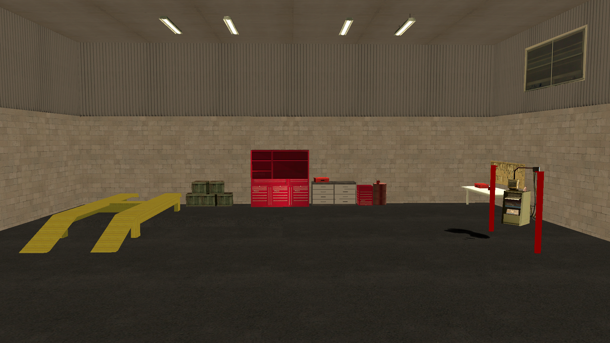

# maps-collection

El maps-collection es un repositorio dedicado a proporcionar gratuitamente una colección diversa de mapeos para SA-MP (San Andreas Multiplayer). Nuestro objetivo es ofrecer mapeos para desarrolladores y creadores de servidores, facilitando la creación de entornos inmersivos y personalizados en sus servidores.

## Idiomas

- Português: [README](../../)
- Deutsch: [README](../Deutsch/README.md)
- English: [README](../English/README.md)
- Français: [README](../Francais/README.md)
- Italiano: [README](../Italiano/README.md)
- Polski: [README](../Polski/README.md)
- Русский: [README](../Русский/README.md)
- Svenska: [README](../Svenska/README.md)
- Türkçe: [README](../Turkce/README.md)

## Índice

- [maps-collection](#maps-collection)
  - [Idiomas](#idiomas)
  - [Índice](#índice)
  - [Características](#características)
  - [Mapeos](#mapeos)
    - [Taller Mecánico](#taller-mecánico)
  - [Licencia](#licencia)
    - [Lo que puedes hacer ✅](#lo-que-puedes-hacer-)
    - [Lo que debes hacer ⚠️](#lo-que-debes-hacer-️)
    - [Lo que no puedes hacer ❌](#lo-que-no-puedes-hacer-)

## Características

Los mapeos proporcionados se distribuyen en formato de includes, ofreciendo la máxima flexibilidad para los desarrolladores. Los usuarios pueden:

- Activar simplemente el include en su Gamemode, integrando instantáneamente el mapeo completo.
- Copiar el código fuente y adaptarlo directamente en su propio Gamemode, si prefieren una personalización más detallada.

Los includes se desarrollan con inteligencia y compatibilidad en mente:

- Cuentan con verificaciones condicionales `#if !defined` y `#elseif defined` para la detección automática del include/plugin [streamer](https://github.com/samp-incognito/samp-streamer-plugin).
- Si el plugin [streamer](https://github.com/samp-incognito/samp-streamer-plugin) está activo, los objetos se crean utilizando `CreateDynamicObject()`.
- Si el include/plugin [streamer](https://github.com/samp-incognito/samp-streamer-plugin) no está presente, los objetos se crean con `CreateObject()`.

## Mapeos

### Taller Mecánico

- Include: [01-workshop](../../maps-sources/01-workshop.inc)
- Screenshots:
  
  
  
  
  
  
  

## Licencia

Copyright © SA-MP Programming Community

Permission is hereby granted, free of charge, to any person obtaining a copy
of this software and associated documentation files (the "Software"), to deal
in the Software without restriction, including without limitation the rights
to use, copy, modify, merge, publish, distribute, sublicense, and/or sell
copies of the Software, and to permit persons to whom the Software is
furnished to do so, subject to the following conditions:

The above copyright notice and this permission notice shall be included in all
copies or substantial portions of the Software.

THE SOFTWARE IS PROVIDED "AS IS", WITHOUT WARRANTY OF ANY KIND, EXPRESS OR
IMPLIED, INCLUDING BUT NOT LIMITED TO THE WARRANTIES OF MERCHANTABILITY,
FITNESS FOR A PARTICULAR PURPOSE AND NONINFRINGEMENT. IN NO EVENT SHALL THE
AUTHORS OR COPYRIGHT HOLDERS BE LIABLE FOR ANY CLAIM, DAMAGES OR OTHER
LIABILITY, WHETHER IN AN ACTION OF CONTRACT, TORT OR OTHERWISE, ARISING FROM,
OUT OF OR IN CONNECTION WITH THE SOFTWARE OR THE USE OR OTHER DEALINGS IN THE
SOFTWARE.

Puede obtener una copia de la licencia en:
https://opensource.org/licenses/MIT

### Lo que puedes hacer ✅

1. **Uso Comercial**: 
   - Libertad total para uso comercial
   - Puede vender productos basados en el código
   - Sin necesidad de pago de regalías
   - Puede usar en productos propietarios

2. **Modificación**: 
   - Modificación completa del código fuente
   - Crear trabajos derivados
   - Adaptar para cualquier propósito
   - Integrar con otros sistemas

3. **Distribución**: 
   - Distribuir el software original
   - Compartir versiones modificadas
   - Incluir en otros proyectos
   - Distribuir comercialmente

4. **Uso Privado**: 
   - Uso en proyectos privados
   - Modificaciones confidenciales
   - Sin obligación de divulgación
   - Uso interno sin restricciones

5. **Sublicenciamiento**: 
   - Puede cambiar la licencia del código derivado
   - Elegir diferentes términos para sus modificaciones
   - Combinar con otras licencias
   - Crear términos propios para distribución

### Lo que debes hacer ⚠️

1. **Incluir Licencia**: 
   - Mantener copia de la licencia con el código
   - Incluir en todas las distribuciones
   - Preservar texto original
   - Mantener visible y accesible

2. **Atribución**: 
   - Mantener aviso de derechos de autor
   - Incluir en todas las copias
   - Preservar créditos originales
   - Documentar origen del código

### Lo que no puedes hacer ❌

1. **Responsabilizar a los Autores**: 
   - Sin garantías de funcionamiento
   - Autores no son responsables por daños
   - Sin soporte obligatorio
   - Uso por cuenta y riesgo