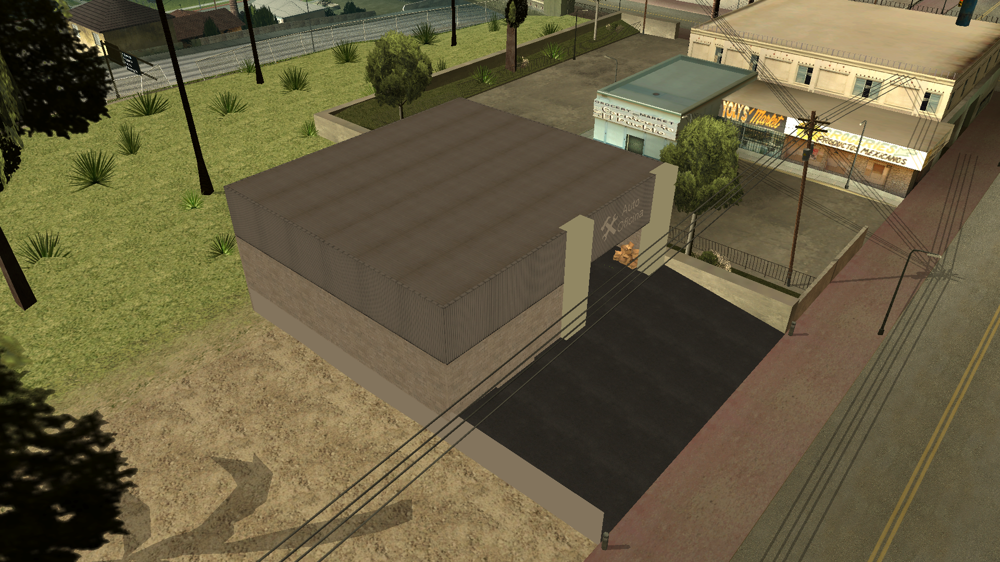

# maps-collection

Il maps-collection è un repository dedicato a fornire gratuitamente una raccolta diversificata di mappe per SA-MP (San Andreas Multiplayer). Il nostro obiettivo è fornire mappe per sviluppatori e creatori di server, facilitando la creazione di ambienti immersivi e personalizzati nei loro server.

## Lingue

- Português: [README](../../)
- Deutsch: [README](../Deutsch/README.md)
- English: [README](../English/README.md)
- Español: [README](../Espanol/README.md)
- Français: [README](../Francais/README.md)
- Polski: [README](../Polski/README.md)
- Русский: [README](../Русский/README.md)
- Svenska: [README](../Svenska/README.md)
- Türkçe: [README](../Turkce/README.md)

## Indice

- [maps-collection](#maps-collection)
  - [Lingue](#lingue)
  - [Indice](#indice)
  - [Caratteristiche](#caratteristiche)
  - [Mappe](#mappe)
    - [Officina Auto](#officina-auto)
  - [Licenza](#licenza)
    - [Termini e Condizioni d'Uso](#termini-e-condizioni-duso)
      - [1. Permessi Concessi](#1-permessi-concessi)
      - [2. Condizioni Obbligatorie](#2-condizioni-obbligatorie)
      - [3. Diritti d'Autore](#3-diritti-dautore)
      - [4. Esclusione di Garanzia e Limitazione di Responsabilità](#4-esclusione-di-garanzia-e-limitazione-di-responsabilità)

## Caratteristiche

Le mappe fornite sono distribuite in formato include, offrendo la massima flessibilità per gli sviluppatori. Gli utenti possono:

- Attivare semplicemente l'include nel proprio Gamemode, integrando istantaneamente l'intera mappatura.
- Copiare il codice sorgente e adattarlo direttamente nel proprio Gamemode, se preferiscono una personalizzazione più dettagliata.

Gli include sono sviluppati con intelligenza e compatibilità in mente:

- Contengono verifiche condizionali `#if !defined` e `#elseif defined` per il rilevamento automatico dell'include/plugin [streamer](https://github.com/samp-incognito/samp-streamer-plugin).
- Se il plugin [streamer](https://github.com/samp-incognito/samp-streamer-plugin) è attivo, gli oggetti vengono creati utilizzando `CreateDynamicObject()`.
- Qualora l'include/plugin [streamer](https://github.com/samp-incognito/samp-streamer-plugin) non sia presente, gli oggetti vengono creati con `CreateObject()`.

## Mappe

### Officina Auto

- Include: [01-workshop](../../maps-sources/01-workshop.inc)
- Screenshots:
  
  
  
  
  
  
  

## Licenza

Copyright © **SA-MP Programming Community**

Questo software è concesso in licenza secondo i termini della Licenza MIT ("Licenza"); è possibile utilizzare questo software in conformità con le condizioni della Licenza. Una copia della Licenza può essere ottenuta su: [MIT License](https://opensource.org/licenses/MIT)

### Termini e Condizioni d'Uso

#### 1. Permessi Concessi

La presente licenza concede gratuitamente a chiunque ottenga una copia di questo software e dei file di documentazione associati i seguenti diritti:
* Utilizzare, copiare, modificare, unire, pubblicare, distribuire, sublicenziare e/o vendere copie del software senza restrizioni
* Permettere alle persone a cui il software viene fornito di fare lo stesso, soggetto alle seguenti condizioni

#### 2. Condizioni Obbligatorie

Tutte le copie o parti sostanziali del software devono includere:
* L'avviso di copyright sopra riportato
* Questo avviso di permesso
* L'avviso di esclusione di responsabilità sotto riportato

#### 3. Diritti d'Autore

Il software e tutta la documentazione associata sono protetti dalle leggi sul diritto d'autore. La **SA-MP Programming Community** mantiene la titolarità dei diritti d'autore originali del software.

#### 4. Esclusione di Garanzia e Limitazione di Responsabilità

IL SOFTWARE VIENE FORNITO "COSÌ COM'È", SENZA GARANZIE DI ALCUN TIPO, ESPLICITE O IMPLICITE, INCLUSE, MA NON LIMITATE A, LE GARANZIE DI COMMERCIABILITÀ, IDONEITÀ PER UN PARTICOLARE SCOPO E NON VIOLAZIONE.

IN NESSUN CASO GLI AUTORI O I TITOLARI DEL COPYRIGHT SARANNO RESPONSABILI PER QUALSIASI RECLAMO, DANNO O ALTRA RESPONSABILITÀ, SIA IN UN'AZIONE DI CONTRATTO, ILLECITO O ALTRO, DERIVANTE DA, FUORI O IN CONNESSIONE CON IL SOFTWARE O L'USO O ALTRE OPERAZIONI NEL SOFTWARE.

---

Per informazioni dettagliate sulla Licenza MIT, consultare: https://opensource.org/licenses/MIT