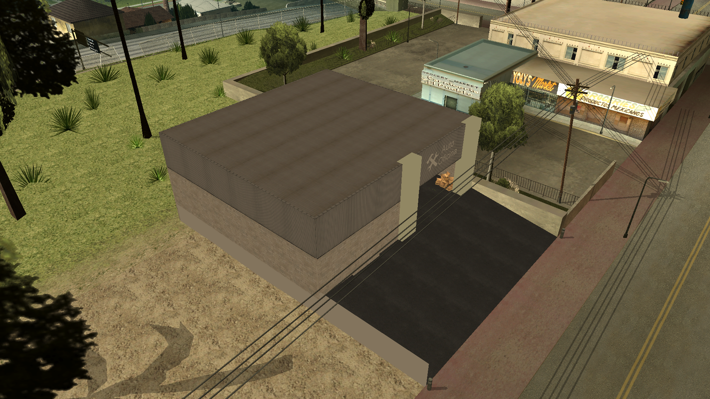
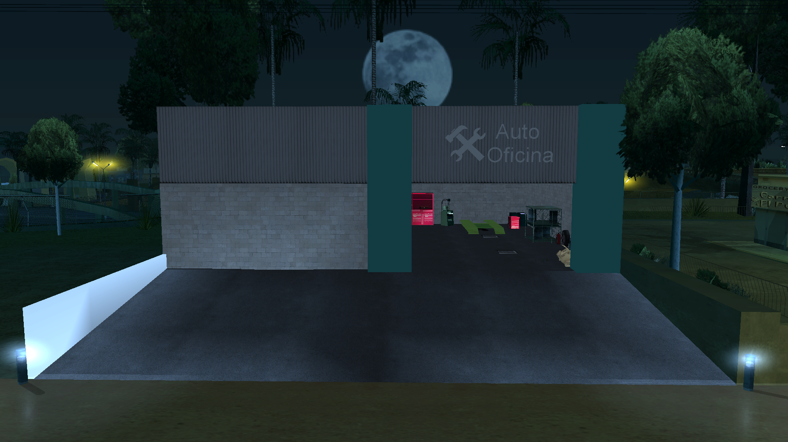
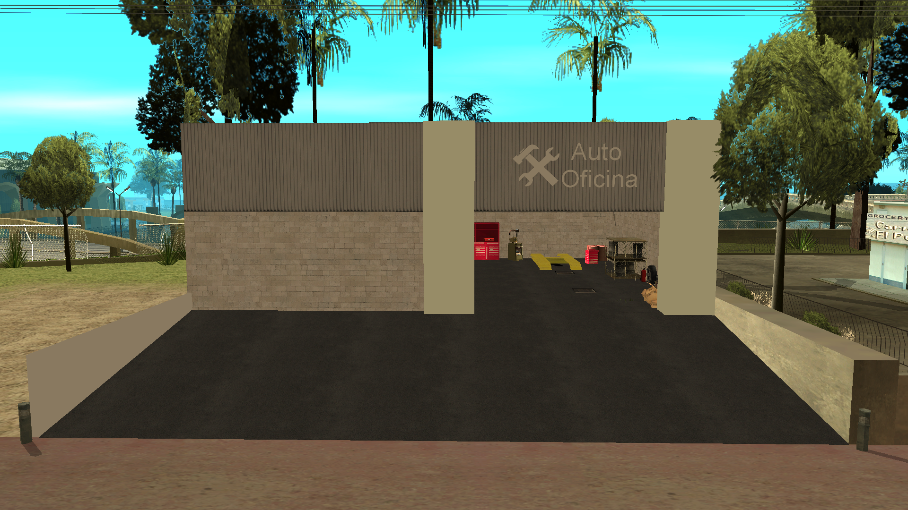
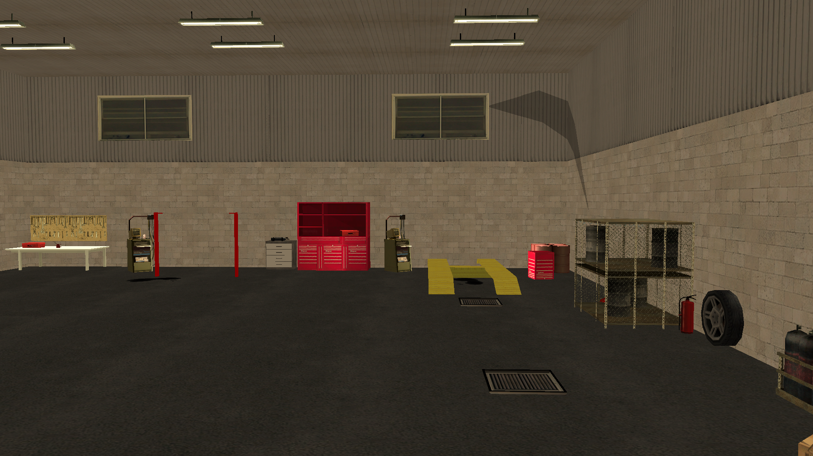
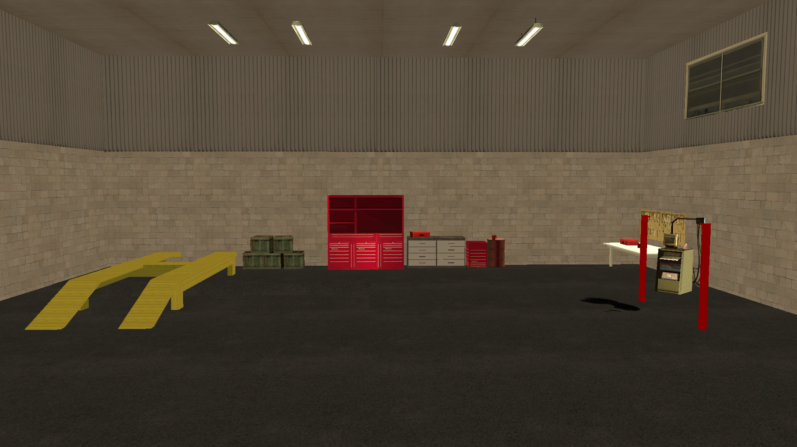
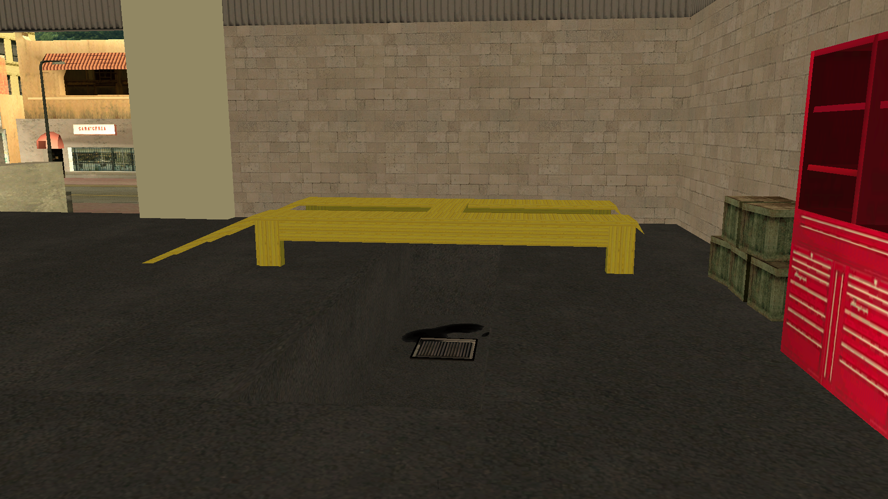
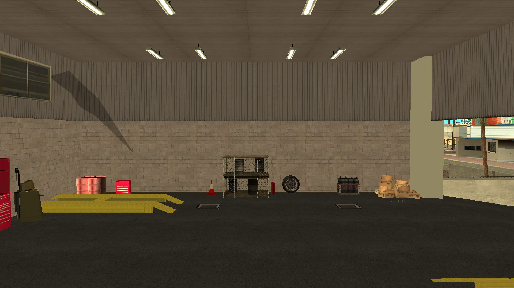

# maps-collection

Maps-collection är ett repository som dedicerat tillhandahåller en mångsidig samling av mappningar för SA-MP (San Andreas Multiplayer). Vårt mål är att erbjuda mappningar för utvecklare och serverkapare, vilket underlättar skapandet av immersiva och anpassade miljöer i deras servrar.

## Språk

- Português: [README](../../)
- Deutsch: [README](../Deutsch/README.md)
- English: [README](../English/README.md)
- Español: [README](../Espanol/README.md)
- Français: [README](../Francais/README.md)
- Italiano: [README](../Italiano/README.md)
- Polski: [README](../Polski/README.md)
- Русский: [README](../Русский/README.md)
- Türkçe: [README](../Turkce/README.md)

## Innehållsförteckning

- [maps-collection](#maps-collection)
  - [Språk](#språk)
  - [Innehållsförteckning](#innehållsförteckning)
  - [Funktioner](#funktioner)
  - [Mappningar](#mappningar)
    - [Bilverkstad](#bilverkstad)
  - [Licens](#licens)
    - [Vad du kan göra ✅](#vad-du-kan-göra-)
    - [Vad du måste göra ⚠️](#vad-du-måste-göra-️)
    - [Vad du inte kan göra ❌](#vad-du-inte-kan-göra-)

## Funktioner

De tillhandahållna mappningarna distribueras i form av includes, vilket erbjuder maximal flexibilitet för utvecklare. Användare kan:

- Aktivera include i sin Gamemode och omedelbart integrera hela mappningen.
- Kopiera källkoden och anpassa direkt i sin egen Gamemode om de föredrar mer detaljerad anpassning.

Includes är utvecklade med intelligens och kompatibilitet i åtanke:

- Har villkorliga kontroller `#if !defined` och `#elseif defined` för automatisk identifiering av include/plugin [streamer](https://github.com/samp-incognito/samp-streamer-plugin).
- Om [streamer](https://github.com/samp-incognito/samp-streamer-plugin)-pluginen är aktiv, skapas objekt med `CreateDynamicObject()`.
- Om include/plugin [streamer](https://github.com/samp-incognito/samp-streamer-plugin) inte är närvarande, skapas objekt med `CreateObject()`.

## Mappningar

### Bilverkstad

- Include: [01-workshop](../../maps-sources/01-workshop.inc)
- Screenshots:
  
  
  
  
  
  
  

## Licens

Copyright © SA-MP Programming Community

Permission is hereby granted, free of charge, to any person obtaining a copy
of this software and associated documentation files (the "Software"), to deal
in the Software without restriction, including without limitation the rights
to use, copy, modify, merge, publish, distribute, sublicense, and/or sell
copies of the Software, and to permit persons to whom the Software is
furnished to do so, subject to the following conditions:

The above copyright notice and this permission notice shall be included in all
copies or substantial portions of the Software.

THE SOFTWARE IS PROVIDED "AS IS", WITHOUT WARRANTY OF ANY KIND, EXPRESS OR
IMPLIED, INCLUDING BUT NOT LIMITED TO THE WARRANTIES OF MERCHANTABILITY,
FITNESS FOR A PARTICULAR PURPOSE AND NONINFRINGEMENT. IN NO EVENT SHALL THE
AUTHORS OR COPYRIGHT HOLDERS BE LIABLE FOR ANY CLAIM, DAMAGES OR OTHER
LIABILITY, WHETHER IN AN ACTION OF CONTRACT, TORT OR OTHERWISE, ARISING FROM,
OUT OF OR IN CONNECTION WITH THE SOFTWARE OR THE USE OR OTHER DEALINGS IN THE
SOFTWARE.

Du kan få en kopia av licensen på:
https://opensource.org/licenses/MIT

### Vad du kan göra ✅

1. **Kommersiell användning**: 
   - Total frihet för kommersiell användning
   - Kan sälja produkter baserade på koden
   - Inga royalties krävs
   - Kan användas i proprietära produkter

2. **Modifiering**: 
   - Fullständig modifiering av källkoden
   - Skapa härledda verk
   - Anpassa för alla ändamål
   - Integrera med andra system

3. **Distribution**: 
   - Distribuera originalprogramvaran
   - Dela modifierade versioner
   - Inkludera i andra projekt
   - Distribuera kommersiellt

4. **Privat användning**: 
   - Användning i privata projekt
   - Konfidentiella modifieringar
   - Ingen skyldighet att avslöja
   - Obegränsad intern användning

5. **Underlicensiering**: 
   - Kan ändra licensen för härledd kod
   - Välja olika villkor för dina modifieringar
   - Kombinera med andra licenser
   - Skapa egna distributionsvillkor

### Vad du måste göra ⚠️

1. **Inkludera licens**: 
   - Behåll en kopia av licensen med koden
   - Inkludera i alla distributioner
   - Bevara originaltext
   - Håll den synlig och tillgänglig

2. **Attribution**: 
   - Behåll upphovsrättsmeddelande
   - Inkludera i alla kopior
   - Bevara ursprungliga krediter
   - Dokumentera kodens ursprung

### Vad du inte kan göra ❌

1. **Hålla författarna ansvariga**: 
   - Inga garantier för funktion
   - Författarna är inte ansvariga för skador
   - Inget obligatoriskt support
   - Användning på egen risk