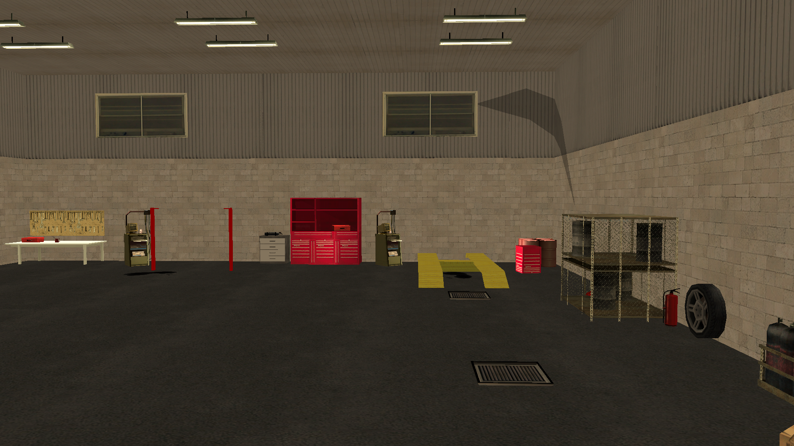

# Maps Collection

Maps Collection, SA-MP (San Andreas Multiplayer) için çeşitli haritalama koleksiyonunu ücretsiz olarak sunmaya adanmış bir depodur. Amacımız, geliştiricilere ve sunucu oluşturucularına, sunucularında sürükleyici ve özelleştirilmiş ortamlar oluşturmalarını kolaylaştıran haritalamalar sağlamaktır.

## Diller

- Português: [README](../../)
- Deutsch: [README](../Deutsch/README.md)
- English: [README](../English/README.md)
- Español: [README](../Espanol/README.md)
- Français: [README](../Francais/README.md)
- Italiano: [README](../Italiano/README.md)
- Polski: [README](../Polski/README.md)
- Русский: [README](../Русский/README.md)
- Svenska: [README](../Svenska/README.md)

## İçindekiler

- [Maps Collection](#maps-collection)
  - [Diller](#diller)
  - [İçindekiler](#i̇çindekiler)
  - [Özellikler](#özellikler)
  - [Haritalar](#haritalar)
    - [Oto Servisi](#oto-servisi)
  - [Lisans](#lisans)
    - [Kullanım Şartları ve Koşulları](#kullanım-şartları-ve-koşulları)
      - [1. Verilen İzinler](#1-verilen-i̇zinler)
      - [2. Zorunlu Koşullar](#2-zorunlu-koşullar)
      - [3. Telif Hakları](#3-telif-hakları)
      - [4. Garanti Reddi ve Sorumluluk Sınırlaması](#4-garanti-reddi-ve-sorumluluk-sınırlaması)

## Özellikler

Sağlanan haritalar, geliştiricilere maksimum esneklik sunan include formatında dağıtılmaktadır. Kullanıcılar:

- Haritamayı anında entegre etmek için Gamemode'larında include'u etkinleştirebilirler.
- Daha detaylı özelleştirme için kaynak kodu kopyalayıp doğrudan kendi Gamemode'larına adapte edebilirler.

Include'lar zeka ve uyumluluk göz önünde bulundurularak geliştirilmiştir:

- Include/plugin [streamer](https://github.com/samp-incognito/samp-streamer-plugin)'ın otomatik tespiti için koşullu `#if !defined` ve `#elseif defined` kontrolleri içerir.
- [Streamer](https://github.com/samp-incognito/samp-streamer-plugin) eklentisi aktifse, nesneler `CreateDynamicObject()` kullanılarak oluşturulur.
- [Streamer](https://github.com/samp-incognito/samp-streamer-plugin) include/plugin mevcut değilse, nesneler `CreateObject()` ile oluşturulur.

## Haritalar

### Oto Servisi

- Include: [01-workshop](../../maps-sources/01-workshop.inc)
- Screenshots:
  
  
  
  
  
  
  

## Lisans

Copyright © **SA-MP Programming Community**

Bu yazılım MIT Lisansı ("Lisans") şartları altında lisanslanmıştır; bu yazılımı Lisans şartlarına uygun olarak kullanabilirsiniz. Lisansın bir kopyasını şu adresten edinebilirsiniz: [MIT License](https://opensource.org/licenses/MIT)

### Kullanım Şartları ve Koşulları

#### 1. Verilen İzinler

Bu lisans, bu yazılımın ve ilgili dokümantasyon dosyalarının bir kopyasını edinen herhangi bir kişiye ücretsiz olarak aşağıdaki hakları vermektedir:
* Yazılımın kopyalarını kullanma, kopyalama, değiştirme, birleştirme, yayınlama, dağıtma, alt lisans verme ve/veya satma hakkı
* Yazılımın sağlandığı kişilerin de aynısını yapmasına izin verme hakkı (aşağıdaki koşullara tabi olmak kaydıyla)

#### 2. Zorunlu Koşullar

Yazılımın tüm kopyaları veya önemli parçaları şunları içermelidir:
* Yukarıdaki telif hakkı bildirimi
* Bu izin bildirimi
* Aşağıdaki sorumluluk reddi

#### 3. Telif Hakları

Yazılım ve ilgili tüm dokümantasyon telif hakkı yasaları ile korunmaktadır. **SA-MP Programming Community** yazılımın orijinal telif haklarını elinde tutmaktadır.

#### 4. Garanti Reddi ve Sorumluluk Sınırlaması

YAZILIM "OLDUĞU GİBİ" SAĞLANMAKTADIR, HİÇBİR TÜRDE GARANTİ VERİLMEMEKTEDİR, AÇIK VEYA ZIMNİ, TİCARİ ELVERİŞLİLİK, BELİRLİ BİR AMACA UYGUNLUK VE İHLAL ETMEME GARANTİLERİ DAHİL ANCAK BUNLARLA SINIRLI OLMAMAK ÜZERE.

HİÇBİR KOŞULDA YAZARLAR VEYA TELİF HAKKI SAHİPLERİ HERHANGİ BİR İDDİA, HASAR VEYA DİĞER YÜKÜMLÜLÜKLERDEN SORUMLU TUTULAMAZ, İSTER SÖZLEŞME KAPSAMINDA, HAKSIZ FİİL VEYA BAŞKA BİR ŞEKİLDE OLSUN, YAZILIMDAN VEYA YAZILIMIN KULLANIMINDAN VEYA DİĞER İŞLEMLERDEN KAYNAKLANAN DURUMLAR İÇİN.

---

MIT Lisansı hakkında detaylı bilgi için: https://opensource.org/licenses/MIT