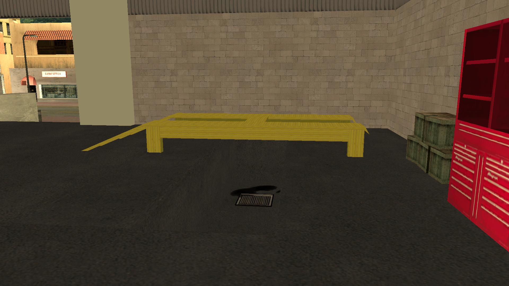

# maps-collection

Maps-collection - это репозиторий, посвященный бесплатному предоставлению разнообразной коллекции картографирования для SA-MP (San Andreas Multiplayer). Наша цель - предоставить картографирование разработчикам и создателям серверов, облегчая создание погружающих и персонализированных сред на их серверах.

## Языки

- Português: [README](../../)
- Deutsch: [README](../Deutsch/README.md)
- English: [README](../English/README.md)
- Español: [README](../Espanol/README.md)
- Français: [README](../Francais/README.md)
- Italiano: [README](../Italiano/README.md)
- Polski: [README](../Polski/README.md)
- Svenska: [README](../Svenska/README.md)
- Türkçe: [README](../Turkce/README.md)

## Оглавление

- [maps-collection](#maps-collection)
  - [Языки](#языки)
  - [Оглавление](#оглавление)
  - [Характеристики](#характеристики)
  - [Картографирование](#картографирование)
    - [Авто Мастерская](#авто-мастерская)
  - [Лицензия](#лицензия)
    - [Условия использования](#условия-использования)
      - [1. Предоставленные разрешения](#1-предоставленные-разрешения)
      - [2. Обязательные условия](#2-обязательные-условия)
      - [3. Авторские права](#3-авторские-права)
      - [4. Отказ от гарантий и ограничение ответственности](#4-отказ-от-гарантий-и-ограничение-ответственности)

## Характеристики

Предоставляемые картографирования распространяются в формате includes, предлагая максимальную гибкость для разработчиков. Пользователи могут:

- Просто активировать include в своем Gamemode, мгновенно интегрируя полное картографирование.
- Копировать исходный код и адаптировать его непосредственно в своем собственном Gamemode, если предпочитают более подробную настройку.

Includes разработаны с учетом интеллекта и совместимости:

- Имеют условные проверки `#if !defined` и `#elseif defined` для автоматического обнаружения include/plugin [streamer](https://github.com/samp-incognito/samp-streamer-plugin).
- Если плагин [streamer](https://github.com/samp-incognito/samp-streamer-plugin) активен, объекты создаются с использованием `CreateDynamicObject()`.
- Если include/plugin [streamer](https://github.com/samp-incognito/samp-streamer-plugin) отсутствует, объекты создаются с помощью `CreateObject()`.

## Картографирование

### Авто Мастерская

- Include: [01-workshop](../../maps-sources/01-workshop.inc)
- Screenshots:
  
  
  
  
  
  
  

## Лицензия

Copyright © **SA-MP Programming Community**

Данное программное обеспечение лицензируется в соответствии с условиями лицензии MIT ("Лицензия"); вы можете использовать это программное обеспечение в соответствии с условиями Лицензии. Копию Лицензии можно получить по адресу: [MIT License](https://opensource.org/licenses/MIT)

### Условия использования

#### 1. Предоставленные разрешения

Настоящая лицензия бесплатно предоставляет любому лицу, получающему копию данного программного обеспечения и связанных с ним файлов документации, следующие права:
* Использовать, копировать, изменять, объединять, публиковать, распространять, сублицензировать и/или продавать копии программного обеспечения без ограничений
* Разрешать лицам, которым предоставляется программное обеспечение, делать то же самое при соблюдении указанных ниже условий

#### 2. Обязательные условия

Все копии или существенные части программного обеспечения должны включать:
* Вышеуказанное уведомление об авторских правах
* Данное уведомление о разрешении
* Приведенное ниже заявление об отказе от ответственности

#### 3. Авторские права

Программное обеспечение и вся связанная с ним документация защищены законами об авторских правах. **SA-MP Programming Community** сохраняет за собой оригинальные авторские права на программное обеспечение.

#### 4. Отказ от гарантий и ограничение ответственности

ПРОГРАММНОЕ ОБЕСПЕЧЕНИЕ ПРЕДОСТАВЛЯЕТСЯ "КАК ЕСТЬ", БЕЗ КАКИХ-ЛИБО ГАРАНТИЙ, ЯВНЫХ ИЛИ ПОДРАЗУМЕВАЕМЫХ, ВКЛЮЧАЯ, НО НЕ ОГРАНИЧИВАЯСЬ ГАРАНТИЯМИ ТОВАРНОЙ ПРИГОДНОСТИ, ПРИГОДНОСТИ ДЛЯ КОНКРЕТНОЙ ЦЕЛИ И НЕНАРУШЕНИЯ ПРАВ.

НИ ПРИ КАКИХ ОБСТОЯТЕЛЬСТВАХ АВТОРЫ ИЛИ ПРАВООБЛАДАТЕЛИ НЕ НЕСУТ ОТВЕТСТВЕННОСТИ ЗА ЛЮБЫЕ ПРЕТЕНЗИИ, УБЫТКИ ИЛИ ИНУЮ ОТВЕТСТВЕННОСТЬ, БУДЬ ТО В СИЛУ ДОГОВОРА, ДЕЛИКТА ИЛИ ИНЫМ ОБРАЗОМ, ВОЗНИКАЮЩИЕ ИЗ, ИЗ-ЗА ИЛИ В СВЯЗИ С ПРОГРАММНЫМ ОБЕСПЕЧЕНИЕМ ИЛИ ИСПОЛЬЗОВАНИЕМ ИЛИ ИНЫМИ ДЕЙСТВИЯМИ С ПРОГРАММНЫМ ОБЕСПЕЧЕНИЕМ.

---

Для подробной информации о лицензии MIT посетите: https://opensource.org/licenses/MIT